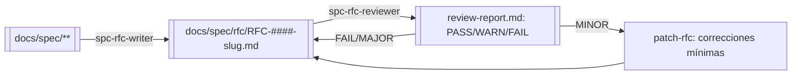
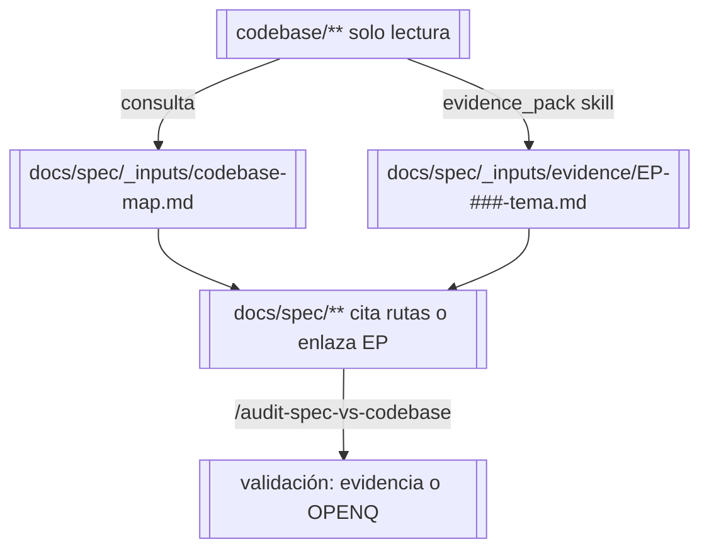

# Sistema de IA del spec-kit: visión general

Este documento explica, de forma didáctica, cómo se utiliza la IA dentro de `spec-kit-template` para crear especificaciones técnicas en `docs/spec/`.

La idea no es “generar texto”, sino sostener un flujo de trabajo **repetible y controlado**, con trazabilidad, gates (OPENQ/DECISION/RFC) y cambios pequeños (diff-friendly).

Ciclo principal: **Plan → Write → Review → Iterate**  
(Con cierre opcional de iteración: **Close**)

Para ello se combinan 4 tipos de componentes:

1) **Instructions** (reglas globales del repositorio)
2) **Custom Agents** (roles de trabajo)
3) **Prompt files** (comandos repetibles)
4) **Skills** (patrones reutilizables de calidad)

---

## 1) Los 4 componentes: qué son y para qué sirven

### 1.1 Instructions (Copilot instructions)

**Qué es:** un conjunto de reglas globales del repo: estilo, alcance, restricciones y proceso.  
**Dónde vive:** `.github/copilot-instructions.md`  
**Para qué sirve:** alinear la “forma de trabajar” del asistente y del equipo. Es el contrato base.

Ejemplos de lo que gobierna:

- “No inventar: si falta info → OPENQ”
- “No tocar docs/kit salvo petición”
- Convenciones de IDs (FR/NFR/UI/API/OPENQ/TODO/ADR)
- Calidad mínima por documento
- Proceso obligatorio Plan → Write → Review → Iterate (+ Close)

**Especificidad:** aplica siempre como “marco” cuando Copilot trabaja en este repo.

---

### 1.2 Custom Agents

**Qué es:** roles predefinidos con responsabilidad y dominio específico.  
**Dónde vive:** `.github/agents/`  
**Para qué sirve:** separar tareas cognitivas y evitar "mezclar todo en una única conversación".

En este template, los agentes se nombran con convención:

- `spc-<fase>-<rol>`
- Fases: `spec` (especificación), `rfc` (propuesta), `imp` (implementación)

Existen 3 suites principales de agentes:

#### Suite SPEC (6 agentes) — Workflow de especificación (director-first)

- **spc-spec-director**: puerta única de entrada (orquesta el resto)
- **spc-spec-intake**: formaliza el contexto recogido por el Director en `docs/spec/00-context.md` (invocado en one-shot)
- **spc-codebase-discovery**: documenta el codebase existente generando mapa y Evidence Packs (opcional, solo modo evolutivo)
- **spc-spec-planner**: convierte estado actual en plan ejecutable (**P01..Pnn** en `docs/spec/01-plan.md`)
- **spc-spec-writer**: ejecuta tareas del plan editando `docs/spec/**`
- **spc-spec-reviewer**: revisión crítica + creación de ADRs

> Nota IDs:
> - SPEC plan: **Pxx** en `docs/spec/01-plan.md`
> - Implementación: **Txx** en `docs/spec/spc-imp-tasks/Txx.md`

#### Suite RFC (2 agentes) — Propuestas ejecutivas/técnicas

- **spc-rfc-writer**: genera RFC (español) como artefacto narrativo para stakeholders desde `docs/spec/**` (multi-archivo)
- **spc-rfc-reviewer**: audita el RFC, detecta invenciones/enlaces rotos/gaps, emite PASS/WARN/FAIL

#### Suite SPC-IMP (3 agentes) — Backlog de implementación

- **spc-imp-backlog-slicer**: genera backlog canónico (T01..Tnn) desde `docs/spec/**` para implementación en CODEBASE
- **spc-imp-task-detailer**: detalla tareas Txx en fichas ejecutables con DoD verificable
- **spc-imp-coverage-auditor**: audita cobertura FR/NFR/ADR/RFC vs backlog+fichas, emite PASS/WARN/FAIL

**Especificidad:** un agente aporta “personalidad operativa”: foco, checklist mental, límites y criterios de delegación entre agentes.

---

### 1.3 Prompt files (comandos)

**Qué es:** comandos reutilizables que ejecutas en Copilot Chat (ej. `/new-spec`).  
**Dónde vive:** `.github/prompts/`  
**Para qué sirve:** encapsular procedimientos repetibles para que el equipo ejecute siempre igual el flujo.

Prompt files típicos:

- `/new-spec` → arranque controlado de la spec
- `/plan-iteration` → crear/actualizar plan de iteración
- `/write-from-plan` → ejecutar el plan
- `/review-and-adr` → revisión crítica + ADRs automáticos
- `/close-iteration` → cierre de iteración + archivado en histórico y limpieza de ficheros activos

**Especificidad:** el prompt es “procedimiento”; el agente es “rol”. Un prompt puede usarse sin seleccionar agente.

---

### 1.4 Skills

**Qué es:** patrones reutilizables de redacción/calidad para secciones concretas (FR, NFR, UI, arquitectura, etc.).  
**Dónde vive:** `.github/skills/`  
**Para qué sirve:** normalizar la salida (estructura, vocabulario, checks) y reducir la variabilidad entre autores.

Ejemplos:

- Cómo redactar FR con criterios verificables
- Cómo redactar NFR con métrica/validación
- Qué incluir en seguridad baseline o infra operativa
- Cómo estructurar arquitectura e integraciones

**Especificidad:** un skill no “manda” el proceso; aporta “cómo hacerlo bien” dentro de una tarea.

---

## 2) Diferencias rápidas (cuándo usar cada uno)

- **Instructions**: “reglas del sistema” (siempre activas).  
- **Agents**: “quién trabaja” (rol / enfoque).  
- **Prompts**: “qué procedimiento ejecuto” (acciones repetibles).  
- **Skills**: “cómo redacto con calidad” (patrón reutilizable).

Una forma útil de verlo:

- Instructions = Constitución
- Agents = Roles
- Prompts = Playbooks
- Skills = Plantillas/patrones de calidad

---

## 3) Relaciones entre componentes

### 3.1 Jerarquía de influencia (de más global a más concreto)

1) **Instructions** (marco general y límites)
2) **Agent** (rol y responsabilidad)
3) **Prompt** (procedimiento específico)
4) **Skills** (patrones de calidad aplicables)

> Nota práctica: prompts y agentes deben respetar siempre las instructions; los skills refuerzan la calidad de la salida en cada documento.

---

## 4) Flujos típicos (cómo se usan en el día a día)

### 4.1 Flujo estándar recomendado (director-first)

1) Hablar con **spc-spec-director** con la intención (qué se quiere lograr)  
2) El director conduce una conversación contextualizada: explica qué va a hacer, pide confirmación, delega al subagente y presenta el resultado.  
   Roles internos que el Director orquesta:
   - Intake (el Director entrevista al usuario; delega a intake en one-shot para formalizar docs)
   - Plan (invoca al Planner)
   - Write (invoca al Writer)
   - Review (invoca al Reviewer) — si el reviewer necesita info del usuario, el Director pregunta
3) Iterar hasta cerrar una iteración (opcional: `/close-iteration`)

Este flujo se repite por iteraciones (I01, I02, …).

#### Alternativa (modo manual por prompts)
Si el equipo prefiere usar prompts explícitos:

1) `/new-spec`  
2) `/plan-iteration`  
3) `/write-from-plan`  
4) `/review-and-adr`  
5) (Opcional) `/close-iteration`

---

### 4.2 Workflow RFC (propuestas ejecutivas/técnicas)

Para generar un RFC consolidado desde la spec distribuida:

1) Ejecutar agente **spc-rfc-writer** (parámetros típicos: TEMA, RFC_ID, VARIANTE)  
   - Genera `docs/spec/rfc/<RFC_ID>-<slug>.md` + artefactos auxiliares en `docs/spec/_inputs/rfc/<RFC_ID>/`
2) Ejecutar agente **spc-rfc-reviewer** (parámetros típicos: RFC_PATH, MODE=report-only)  
   - Audita y genera `review-report.md` con veredicto PASS/WARN/FAIL
3) Si hay mejoras sustanciales: volver a **spc-rfc-writer**  
   Si hay correcciones menores: ejecutar **spc-rfc-reviewer** con MODE=patch-rfc

**Cuándo usar:**

- Para documentos ejecutivos/técnicos consolidados antes de revisiones formales
- Para presentar propuestas a stakeholders
- Cuando necesitas un artefacto narrativo desde una spec multi-file

---

### 4.3 Workflow SPC-IMP (backlog de implementación)

Para convertir la spec en backlog canónico de implementación:

1) Ejecutar agente **spc-imp-backlog-slicer** (parámetros típicos: TEMA, MAX_TASKS, CREATE_STUBS)  
   - Genera `docs/spec/spc-imp-backlog.md` + stubs en `docs/spec/spc-imp-tasks/`
2) Ejecutar agente **spc-imp-task-detailer** (parámetros típicos: TASK_IDS o procesar incompletas)  
   - Genera/actualiza fichas `docs/spec/spc-imp-tasks/Txx.md` con DoD verificable
3) Ejecutar agente **spc-imp-coverage-auditor**  
   - Audita cobertura FR/NFR/ADR/RFC vs backlog+fichas, genera `coverage-report.md` con PASS/WARN/FAIL
4) Si hay huecos: volver a **spc-imp-task-detailer** para crear/ajustar fichas

**Cuándo usar:**

- Cuando la spec está lo suficientemente completa para planificar implementación
- Al inicio de ciclos de desarrollo
- Para planificar trabajo en CODEBASE con trazabilidad a spec

---

### 4.4 Modo evolutivo con codebase

Cuando el workspace contiene un repositorio de código (normalmente root `codebase/`), se puede trabajar en **modo evolutivo**: redactar spec basándose en un proyecto existente.

**Reglas del modo evolutivo:**

- `codebase/**` es **solo lectura** (fuente de verdad técnica as-is)
- Los agentes/prompts consultan `codebase/**` pero **nunca** crean/editan ahí
- Mantener `docs/spec/_inputs/codebase-map.md` como mapa técnico derivado
- Generar Evidence Packs (`docs/spec/_inputs/evidence/EP-###-<tema>.md`) cuando una sección requiera precisión técnica
- Si no hay evidencia suficiente: registrar `OPENQ-###` indicando qué se revisó

**Flujo típico en modo evolutivo:**

1) **Intake/Planner**: confirmar stack/arquitectura básica desde `codebase/**`
2) **Writer**: generar Evidence Packs (skill `evidence_pack`) para secciones especializadas (auth, permisos, datos, integraciones)
3) **Reviewer**: auditar que afirmaciones técnicas tienen evidencia (`codebase/...` o Evidence Packs) o `OPENQ`
4) (Opcional) Ejecutar `/audit-spec-vs-codebase` para validar coherencia spec ↔ codebase

**Qué agentes/prompts soportan modo evolutivo:**

- Agentes SPEC: director, intake, **codebase-discovery**, planner, writer, reviewer
- Prompts: `/new-spec`, `/plan-iteration`, `/write-from-plan`, `/review-and-adr`, `/audit-spec-vs-codebase`, `/evidence-pack`

---

### Nota operativa: estado vivo vs histórico

- `docs/spec/01-plan.md` representa **una única iteración activa** (plan vivo).
- `docs/spec/95-open-questions.md`, `96-todos.md` y `97-review-notes.md` deben mantenerse como **estado vivo** (solo lo relevante/pediente).
- Las iteraciones cerradas se archivan en `docs/spec/history/Ixx/` para evitar planes mezclados y ficheros cada vez más grandes.
- Por defecto, prompts y agentes deben **ignorar `docs/spec/history/**`** al planificar/redactar/revisar (solo se toca con `/close-iteration`).

---

## 5) Diagrama: ciclo de trabajo y artefactos

### Workflow principal (SPEC)

```mermaid
flowchart TD
  U[Usuario] <-->|conversación continua| D[Director]
  D -->|entrevista al usuario + delega one-shot| C[[docs/spec/00-context.md + index.md]]
  D -->|explica + confirma + delega| P[[docs/spec/01-plan.md Pxx]]
  D -->|explica + confirma + delega| S[[Actualiza docs/spec/* + trazabilidad]]
  D -->|explica + confirma + delega| R[[docs/spec/97-review-notes.md]]
  D -->|traslada preguntas de subagentes al usuario| U
  R -->|si DECISION| A[[docs/spec/adr/ADR-####-slug.md]]
  R -->|si faltan datos| Q[[docs/spec/95-open-questions.md]]
  R -->|si trabajo pendiente| T[[docs/spec/96-todos.md]]
  R -->|cerrar iteración| X[/close-iteration]
  X --> H[[docs/spec/history/Ixx/* snapshots]]
  X -->|nueva iteración| P
```

### Workflow RFC (propuestas consolidadas)



### Workflow SPC-IMP (backlog de implementación)

```mermaid
flowchart LR
  SPEC[[docs/spec/**]] -->|spc-imp-backlog-slicer| BL[[docs/spec/spc-imp-backlog.md (Txx)]]
  BL -->|spc-imp-task-detailer| TSK[[docs/spec/spc-imp-tasks/Txx.md]]
  TSK -->|spc-imp-coverage-auditor| COV[[coverage-report.md: PASS/WARN/FAIL]]
  COV -->|gaps detectados| TSK
```

### Modo evolutivo con codebase



(Nota: si Mermaid no se renderiza aún, se puede activar en MkDocs más adelante.)

---

## 6) Reglas operativas que evitan errores frecuentes

### 6.1 Separación Spec vs Kit

* La IA (prompts/agentes) debe editar **solo** `docs/spec/**`.
* `docs/kit/**` solo se modifica si el usuario lo solicita explícitamente.

### 6.2 Histórico de iteraciones (`docs/spec/history/**`)

* `docs/spec/history/**` contiene **snapshots cerrados por iteración**.
* Por defecto, prompts y agentes deben **ignorar** este directorio para planificar/redactar/revisar.
* Solo el prompt `/close-iteration` puede crear/actualizar contenido dentro de `docs/spec/history/**`.

### 6.3 Rutas en `.github/**`

* En prompts/agentes (`.github/**`) usar siempre rutas desde raíz: `docs/spec/...`.
* Evitar enlaces relativos tipo `./adr/...` en `.github/**` para no generar rutas rotas.

### 6.4 Rutas en `docs/spec/**`

* En la spec, enlaces relativos son correctos (por ejemplo `adr/ADR-0002-...md`).

---

## 7) Qué aporta este sistema frente a “un chat que redacta”

* Control del alcance por iteración (plan ejecutable Pxx).
* Calidad mínima reforzada por skills.
* Revisión crítica sistemática (review notes).
* Decisiones visibles (ADR) y trazables.
* Evita inventar: OPENQ como mecanismo de honestidad.
* Evolución versionada (Git) y navegable (MkDocs).
* Evita planes mezclados y "documentos bola de nieve": histórico por iteración (`/close-iteration`).

---

## Lecturas recomendadas

* `51-instructions.md` (detalle de reglas globales)
* `52-custom-agents.md` (roles y delegación programática)
* `53-prompts.md` (comandos y resultados esperados)
* `54-skills.md` (skills core y cómo ampliarlos)

Siguiente lectura recomendada: **`60-uso-del-template.md`**.
